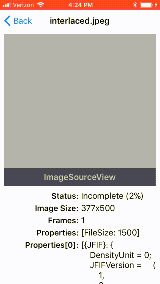

# ImageIO.Swift

[](https://travis-ci.org/davbeck/ImageIOSwift)
[](http://cocoapods.org/pods/ImageIOSwift)
[](http://cocoapods.org/pods/ImageIOSwift)
[](http://cocoapods.org/pods/ImageIOSwift)

[ImageIO](https://developer.apple.com/documentation/imageio) is an Apple framework that provides low level access to image files and is what powers UIImage and other image related operations on iOS and macOS. However, in part because it is a C/Core Foundation framework, using it can be difficult.

ImageIO.Swift is a lightweight wrapper around the framework that makes it much easier to access the vast power that ImageIO provides, including animated GIFs, incremental loading and efficient thumbnail generation.

While there are alternatives that provide many of the same features, and many of them use very similar implimentations based on `ImageIO`, this project provides a unified interface for all uses of ImageIO. So for instance you can use the same view and image processing code for animated images, progressive jpegs, and any other format that ImageIO supports.

## ImageSource

You can think of `CG/NS/UIImage` as a single frame of pixels. `ImageSource` sits a level below that, providing access to almost anything an image *file* provides, including metadata and multiple representations. For instance, animated images have multiple image frames as well as timing metadata.

On iOS, `ImageSourceView` is provided to display image sources, including animations.

### Animated Images

CG/NS/UIImage can only represent a single animation frame from an animated GIF or [PNG](https://en.wikipedia.org/wiki/APNG). ImageSource on the other hand can generate images for each frame of the animation, along with timing data.

To display an animated image, set `isAnimationEnabled = true` on an `ImageSourceView`. Variable delay times and loop counts will even be taken into account. Implimentation is based off of [Apple's sample code](https://developer.apple.com/library/content/samplecode/UsingPhotosFramework/Listings/Shared_AnimatedImageView_swift.html#//apple_ref/doc/uid/TP40014575-Shared_AnimatedImageView_swift-DontLinkElementID_5) and works similarly to [FLAnimatedImage](https://github.com/Flipboard/FLAnimatedImage), although neither of those support aPNG.

### Incremental loading

 

Similar to [https://github.com/contentful-labs/Concorde](Concorde) ImageIO actually support incremental loading out of the box. This can be used with progressive JPEGs to show low resolution versions of an image until the rest of the image loads.

Additionally, animated images can load individual frames incrementally as well. If animation is enabled, `ImageSourceView` will show the first frame loaded until the entire image loads, at which time the animation will begin normally.

```swift
let imageSource = ImageSource.incremental()
imageSourceView.imageSource = imageSource
// as data is loaded, pass in the entire image data
imageSource.update(loadedData, isFinal: loadedData.count == totalCount)
```

### Thumbnails

Depending on the underlying image file and the options passed in, you can get an embeded thumnail in an image or a generated thumbnail.

Typically if you are not using the embeded thumbnail from the image, it is better to load a complete image and draw it in a smaller view than it is to generate a thumbnail (🤷🏽‍♀️), both in terms of time and memory. However if you do need to generate a thumbnail, this method can be quit a bit faster and use *a lot* less memory than loading the image and drawing into a context.

### Metadata

Because images sources can reference a file on disk, you can load metadata for an image without loading the entire file into memory. This is especially useful for getting an images size.

```swift
ImageSource(url: fileURL).properties(at: 0)?.imageSize
```

Note that if the image source is being loaded incrementally or references an invalid file, the size will be nil.

## Example

To run the example project, clone the repo, and run `pod install` from the Example directory first.

## Installation

ImageIOSwift is available through [CocoaPods](http://cocoapods.org). To install
it, simply add the following line to your Podfile:

```ruby
pod 'ImageIOSwift'
```

## License

ImageIOSwift is available under the MIT license. See the LICENSE file for more info.

## Sample Image Sources

- [http://nokiatech.github.io/heif/examples.html](http://nokiatech.github.io/heif/examples.html)
- [http://littlesvr.ca/apng/gif_apng_webp1.html](http://littlesvr.ca/apng/gif_apng_webp1.html)
- [https://github.com/recurser/exif-orientation-examples](https://github.com/recurser/exif-orientation-examples)
- [https://en.wikipedia.org/wiki/APNG](https://en.wikipedia.org/wiki/APNG)